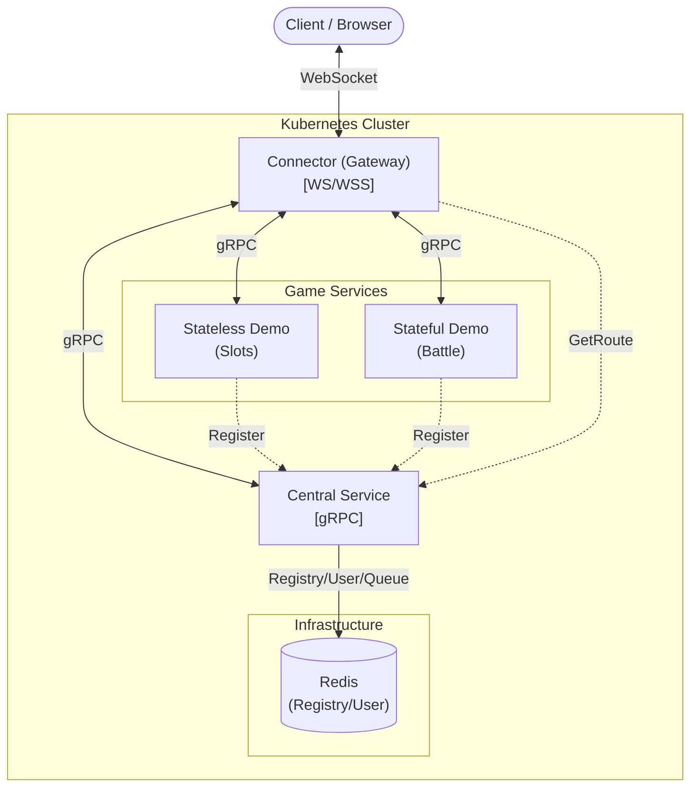

# Go K8s Game Server

[](https://go.dev/)
[](https://github.com/JoeShih716/go-k8s-game-server/actions)
[](https://github.com/JoeShih716/go-k8s-game-server/actions/workflows/go-test.yml)
[](https://www.docker.com/)
[](https://kubernetes.io/)

打造一個生產級的雲原生遊戲伺服器樣板與框架。
本專案採用 **"Engine & Cartridge"** 設計模式，將「伺服器底層 (Engine)」與「遊戲邏輯 (Content)」分離，並引入 **Game Framework** 簡化開發。

## 核心特色 (Features)

- **混合架構 (Hybrid Architecture)**: 同時支援 Stateless (無狀態, e.g. Slots) 與 Stateful (有狀態, e.g. Battle, MMO) 服務。
- **高效通訊 (High Performance)**:
    - **WebSocket**: 針對高併發優化的 Connector 網關。
    - **gRPC**: 服務間通訊 (Inter-Service Communication)，包含雙向即時訊息推送。
- **Game Framework**:
    - **Bootstrap**: 統一的生命週期管理 (Config, Logger, Graceful Shutdown)。
    - **Session Management**: 自動處理玩家連線狀態 (Transient for Stateless, Persistent for Stateful)。
    - **Abstracted RPC**: 簡化底層 gRPC 複雜度，開發者只需實作 `GameHandler` 介面。
- **雲原生就緒 (Cloud Native Ready)**:
    - **Kubernetes**: 完整的 K8s 部署清單 (Manifests) 與環境變數配置。
    - **Observability**: 結構化日誌 (Slog) 與健康檢查 (Health Checks)。
- **開發體驗 (Developer Experience)**:
    - **Air**: 支援 Docker Compose 環境下的熱重載 (Hot Reload)。
    - **CI/CD**: 整合 GitHub Actions 進行自動化 Lint, Test, Build。

## 架構概覽 (Architecture)



### 設計原則 (Design Principles)
本專案嚴格遵循 **Clean Architecture (洋蔥架構)**，將業務邏輯與基礎設施分離：
- **Core Layer (Framework & Domain)**: 定義核心邏輯、介面 (Ports) 與實體 (Entities)。不依賴任何外部套件。
- **Application Layer (Services & Uses Cases)**: 實作具體的業務流程 (e.g., Central Service Login, Game Handler)。
- **Infrastructure Layer (Adapters)**: 實作 Core 定義的介面，對接外部系統 (Redis, gRPC, WebSocket)。

### 核心服務
1.  **Connector (智慧網關)**:
    - 處理 WebSocket 長連線。
    - 負責將客戶端封包路由至後端遊戲服務。
    - 支援 `ConnectorRPC`，允許遊戲服務主動推送訊息 (Push) 或踢除玩家 (Kick)。
2.  **Central (中央控制)**:
    - 服務註冊與發現 (Service Registry via Redis)。
    - 玩家驗證與管理 (User Service via Redis)。
    - 錢包整合 (Wallet Service)。
3.  **Game Services (遊戲邏輯)**:
    - **Stateless Demo**: 實作類似老虎機的 Request-Response 邏輯。
    - **Stateful Demo**: 實作類似戰鬥房的 Persistent Connection 邏輯，支援廣播。

### 遊戲框架 (Game Framework)
- **Peer Concept**: 使用 `Peer` 取代 Session，代表「連線中的玩家」。
    - 每個 `Peer` 皆持有完整的 `domain.User` 資訊 (ID, Name, Balance)。
    - Framework 自動在玩家進入 (OnJoin) 時注入使用者資料與最新錢包餘額。
- **Injection**: 採用 Dependency Injection，將 `UserService` 與 `WalletService` 注入框架。

### 目錄結構 (Directory Structure)

```text
go-k8s-game-server/
├── cmd/                        # [部署入口] Wires dependencies
│   ├── central/                # -> 中央服務
│   ├── connector/              # -> 網關服務
│   └── stateful/               # -> 有狀態遊戲入口
│
├── internal/                   # [內部核心]
│   ├── app/                    # -> Application Layer (Use Cases)
│   │   ├── central/            #    -> Central 業務邏輯
│   │   ├── connector/          #    -> Connector 業務邏輯
│   │   └── game/               #    -> 各遊戲 Handler 實作
│   ├── core/                   # -> Core Layer (Domain logic)
│   │   ├── domain/             #    -> 實體 (User, wallet)
│   │   ├── framework/          #    -> 遊戲框架 (Server, Peer)
│   │   └── ports/              #    -> 介面定義 (Repository Interfaces)
│   └── infrastructure/         # -> Infrastructure Layer
│       ├── persistence/        #    -> 資料庫實作 (Redis)
│       └── service_discovery/  #    -> 服務發現實作
│
└── pkg/                        # [通用工具庫]
    ├── grpc/                   # -> gRPC Pools
    └── redis/                  # -> Redis Client Helper
```

## 快速開始 (Getting Started)

### 先決條件 (Prerequisites)
- Docker & Docker Compose
- Go 1.25+

### 本地開發 (Local Development)

#### 使用 Makefile (推薦)
本專案提供豐富的 `Makefile` 指令來簡化開發流程：

- **`make docker-up`**: 啟動本地開發環境 (支援 Air Hot-reload)。
- **`make docker-down`**: 停止並移除容器。
- **`make docker-logs`**: 查看容器日誌。
- **`make help`**: 查看所有可用指令。
- **`make test`**: 執行單元測試。

#### 手動啟動
```bash
docker-compose up --build
```
此指令會啟動 Redis, Central, Connector 以及 Demo Services。
*(MySQL 為選用，目前主要使用 Redis 進行資料存取)*

2.  **測試連線**:
    開啟瀏覽器訪問 `http://localhost:8080` (內建 WebSocket 測試工具)。
    - **Login**: 輸入任意 UserID (系統會自動建立訪客帳號)。
    - **Connect**: 建立 WebSocket 連線。
    - **Enter Game**: 輸入 GameID (Stateless: 10000, Stateful: 20000)。

### 開發指南 (Development Guide)

#### 新增一個遊戲服務
1.  在 `cmd/` 下建立新目錄。
2.  實作 `internal/core/framework.GameHandler` 介面：
    - `OnJoin(ctx, peer)`: 可透過 `peer.User` 存取玩家資訊。
    - `OnQuit(ctx, peer)`
    - `OnMessage(ctx, peer, payload)`
3.  使用 `bootstrap.RunGameServer` 啟動，Framework 會自動處理依賴注入。

### CI/CD
本專案包含 GitHub Actions Workflow (`.github/workflows/ci.yaml`)，在 Push 或 PR 時自動執行：
- **Lint**: `golangci-lint`
- **Test**: `go test -race ./...`
- **Build**: 驗證所有微服務編譯正常。
