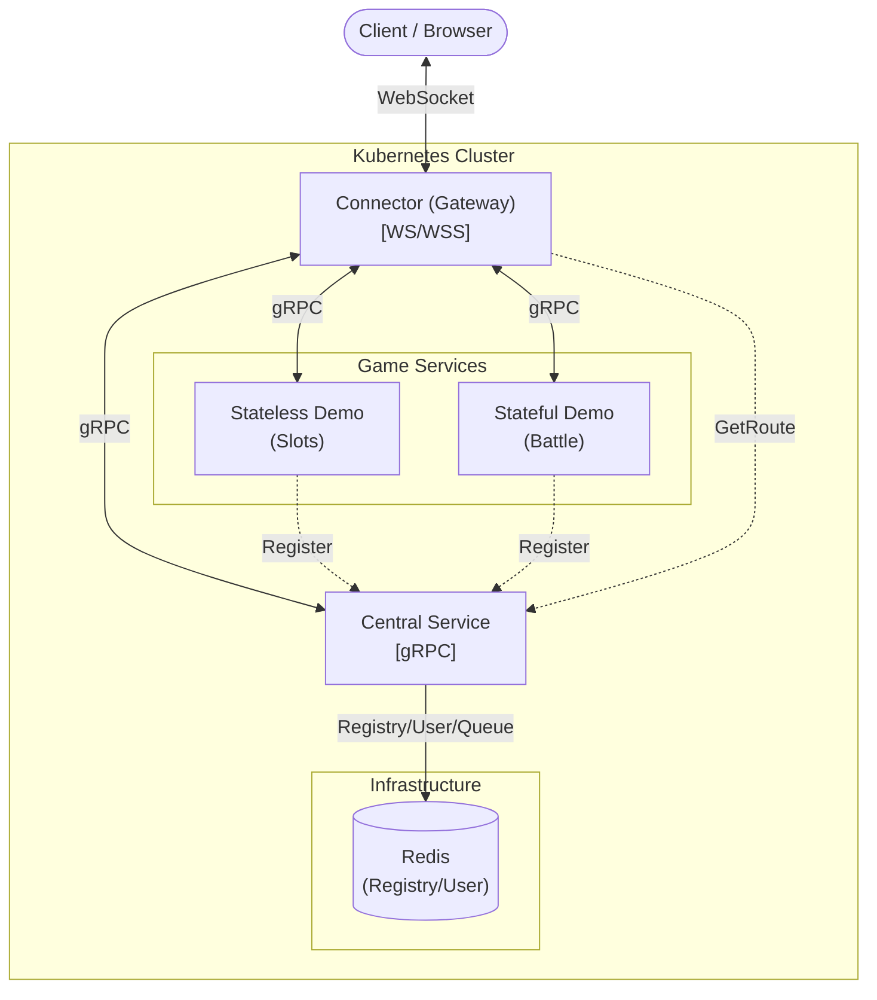

# Go K8s Game Server

[中文](README.md) | **English**

[](https://go.dev/)
[](https://github.com/JoeShih716/go-k8s-game-server/actions)
[](https://codecov.io/gh/JoeShih716/go-k8s-game-server)
[](https://www.docker.com/)
[](https://kubernetes.io/)

A production-grade cloud-native game server template and framework.
This project adopts the **"Engine & Cartridge"** design pattern, separating the "Server Engine" (Infrastructure) from "Game Logic" (Content), and introduces a **Game Framework** to simplify development.

## Features

- **Hybrid Architecture**: Supports both Stateless (e.g., Slots) and Stateful (e.g., Battle, MMO) services.
- **High Performance**:
    - **WebSocket**: Connector gateway optimized for high concurrency.
    - **gRPC**: Inter-Service Communication, including bidirectional real-time message pushing.
- **Game Framework**:
    - **Bootstrap**: Unified lifecycle management (Config, Logger, Graceful Shutdown).
    - **Session Management**: Automatically handles player connection state (Transient for Stateless, Persistent for Stateful).
    - **Abstracted RPC**: Simplifies underlying gRPC complexity; developers only need to implement the `GameHandler` interface.
- **Cloud Native Ready**:
    - **Kubernetes**: Complete K8s deployment manifests and environment variable configuration.
    - **Observability**: Structured logging (Slog) and Health Checks.
- **Developer Experience**:
    - **Air**: Hot Reload support in Docker Compose environment.
    - **CI/CD**: Integrated GitHub Actions for automated Lint, Test, and Build.

## Architecture



### Design Principles
This project strictly follows **Clean Architecture**, separating business logic from infrastructure:
- **Core Layer (Framework & Domain)**: Defines core logic, interfaces (Ports), and entities. Depends on no external packages.
- **Application Layer (Services & Uses Cases)**: Implements concrete business flows (e.g., Central Service Login, Game Handler).
- **Consumer Defined Interfaces**: The Application layer defines its own required interfaces (e.g., `dependencies.go`) instead of depending on concrete implementations, ensuring decoupling and testability.
- **Infrastructure Layer (Adapters)**: Implements interfaces defined in Core, connecting to external systems (Redis, gRPC, WebSocket).

### Core Services
1.  **Connector (Gateway)**:
    - Handles WebSocket long connections.
    - Routes client packets to backend game services.
    - Supports `ConnectorRPC`, allowing game services to actively push messages or kick players.
2.  **Central (Control Plane)**:
    - Service Registry via Redis.
    - User Authentication & Management via Redis.
    - Integration with Wallet Service.
3.  **Game Services (Game Logic)**:
    - **Stateless Demo**: Implements request-response logic similar to slots games.
    - **Stateful Demo**: Implements persistent connection logic similar to battle rooms, supporting broadcasting.

### Game Framework
- **Peer Concept**: Replaces Session with `Peer`, representing a "connected player".
    - Each `Peer` holds complete `domain.User` info (ID, Name, Balance).
    - Framework automatically injects user data and wallet balance upon player entry (OnJoin).
- **Injection**: Uses Dependency Injection to inject `UserService` and `WalletService` into the framework.

### Directory Structure

```text
go-k8s-game-server/
├── cmd/                        # [Entry Point] Wires dependencies
│   ├── central/                # -> Central Service
│   ├── connector/              # -> Gateway Service
│   └── stateful/               # -> Game Server Entry
│
├── config/                     # [Configs] YAML configs and Env vars
├── deploy/                     # [Deployment] Kubernetes Manifests & Dockerfiles
├── docs/                       # [Documents] guides, architecture designs
│
├── internal/                   # [Private Core]
│   ├── app/                    # -> Application Layer (Use Cases)
│   │   ├── central/            #    -> Central business logic
│   │   └── connector/          #    -> Connector business logic
│   ├── core/                   # -> Core Layer (Domain logic)
│   │   ├── domain/             #    -> Entities (User, Wallet)
│   │   └── ports/              #    -> Interfaces (Repository Interfaces)
│   ├── infrastructure/         # -> Infrastructure Layer (Adapters)
│   ├── sdk/                    # -> Internal Microservice SDKs
│   │   ├── central/            #    -> Encapsulates gRPC calls to Central Service (package central_sdk)
│   │   ├── connector/          #    -> Encapsulates gRPC calls to Connector Service (package connector_sdk)
│   │   └── game/               #    -> Encapsulates gRPC calls to Game Server (package game_sdk)
│   └── di/                     # -> Dependency Injection Providers
│
└── pkg/                        # [Public Libraries]
    ├── grpc/                   # -> gRPC Pools
    └── redis/                  # -> Redis Client Helper
```

## Getting Started

### Prerequisites
- Docker & Docker Compose
- Go 1.25+

### Local Development

#### Using Makefile (Recommended)
This project provides rich `Makefile` commands to simplify the development process:

- **`make docker-up`**: Start local dev environment (Supports Air Hot-reload).
- **`make docker-down`**: Stop and remove containers.
- **`make docker-logs`**: View container logs.
- **`make help`**: View all available commands.
- **`make test`**: Run unit tests.

#### Manual Startup
```bash
docker-compose up --build
```
This command starts Redis, Central, Connector, and Demo Services.
*(MySQL is optional; Redis is primarily used for data access currently)*

2.  **Test Connection**:
    Open browser and visit `http://localhost:8080` (Built-in WebSocket Test Tool).
    - **Login**: Enter any UserID (System automatically creates guest account).
    - **Connect**: Establish WebSocket connection.
    - **Enter Game**: Enter GameID (Stateless: 10000, Stateful: 20000).

### Development Guide

#### Adding a New Game Service
1.  Create a new directory under `cmd/`.
2.  Implement `internal/core/framework.GameHandler` interface:
    - `OnJoin(ctx, peer)`: Access player info via `peer.User`.
    - `OnQuit(ctx, peer)`
    - `OnMessage(ctx, peer, payload)`
3.  Start using `bootstrap.RunGameServer`; the Framework handles dependency injection automatically.

### CI/CD
This project includes GitHub Actions Workflow (`.github/workflows/ci.yaml`), triggered on Push or PR:
- **Lint**: `golangci-lint`
- **Test**: `go test -race ./...`
- **Build**: Verifies all microservices compile correctly.
